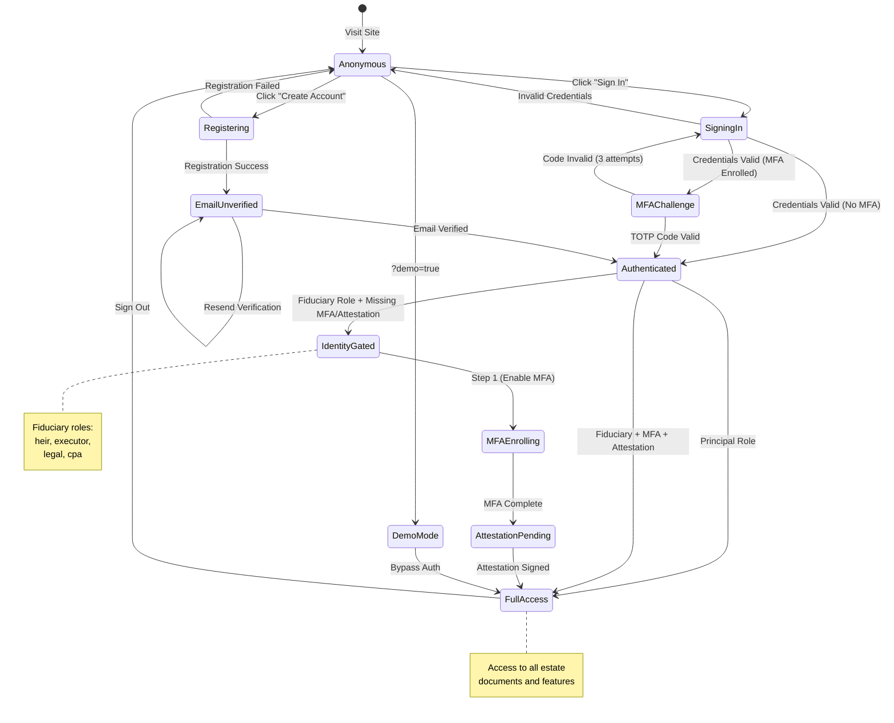
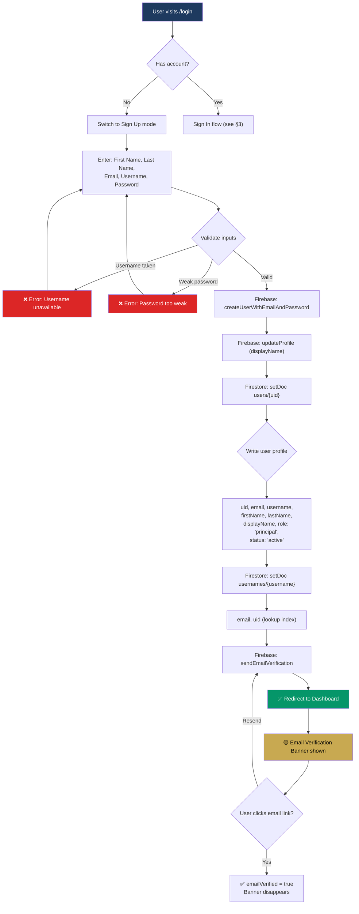
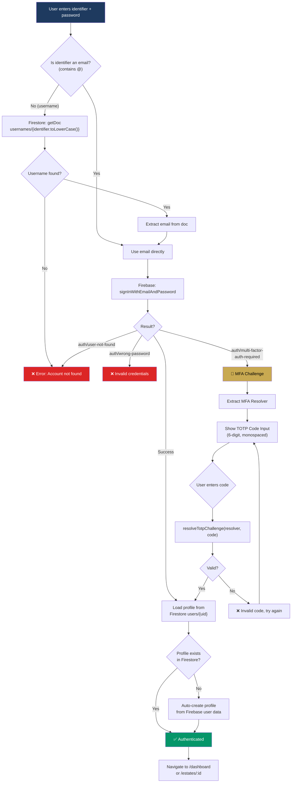
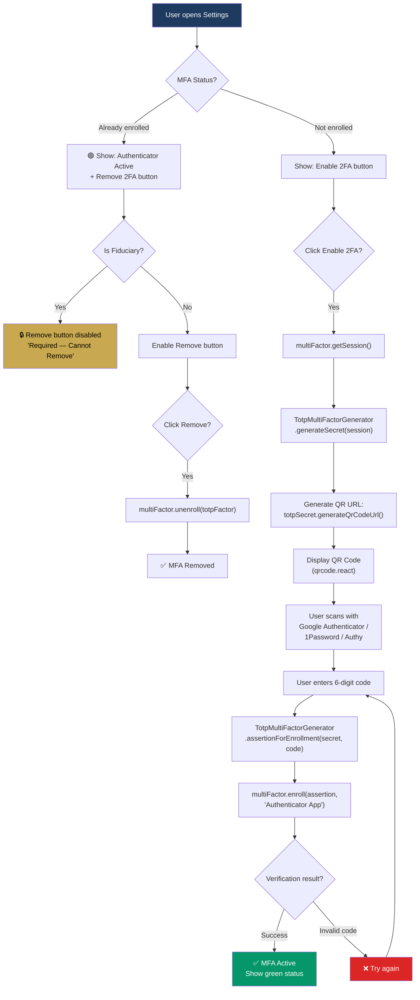
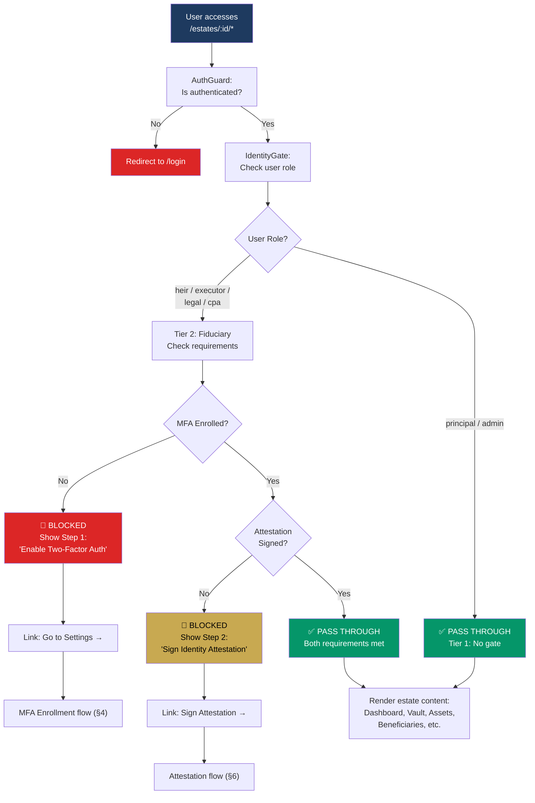
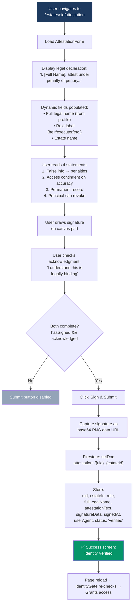
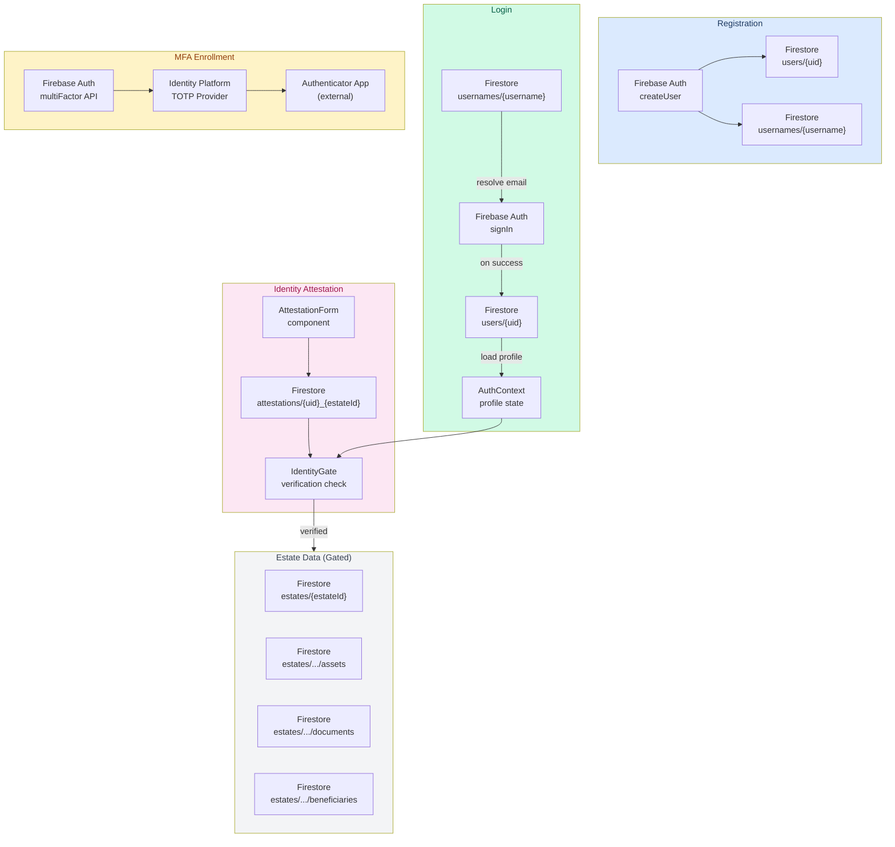
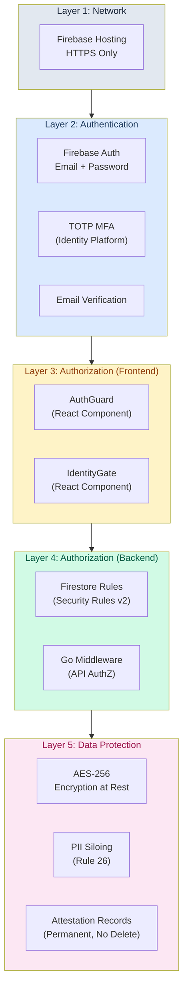
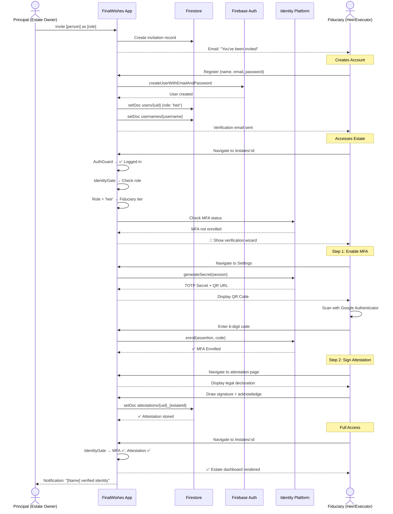

# FinalWishes — Identity & Authentication Workflow Diagrams
**Version:** 1.0.0 · **Date:** March 19, 2026 · **ADR:** 034 (Firebase Auth), 035 (Tiered Identity)

> [!IMPORTANT]
> These diagrams are the canonical source of truth for all authentication, identity verification, and access control flows in FinalWishes.

---

## 1. Complete Auth State Machine

The master state diagram showing every possible user state and transition:

---

## 2. Registration Flow

---

## 3. Sign-In Flow (Email or Username)

---

## 4. MFA TOTP Enrollment Flow

---

## 5. Tiered Identity Verification Gate (ADR-035)

---

## 6. Identity Attestation Signing Flow

---

## 7. Route Protection Hierarchy

```mermaid
flowchart LR
    subgraph Public["🌐 Public (No Auth)"]
        LP["/ Landing Page"]
        LG["/login"]
        UN["Firestore: usernames/*<br/>(read-only)"]
    end
    
    subgraph Authenticated["🔑 AuthGuard (Login Required)"]
        DB["/dashboard/*"]
        ST["/dashboard/settings"]
    end
    
    subgraph Gated["🛡 IdentityGate (MFA + Attestation for Fiduciaries)"]
        ED["/estates/:id/dashboard"]
        EA["/estates/:id/assets"]
        EV["/estates/:id/vault"]
        EB["/estates/:id/beneficiaries"]
        EO["/estates/:id/obituary"]
        EM["/estates/:id/memoirs"]
        EN["/estates/:id/notifications"]
        ES["/estates/:id/settings"]
        EE["/estates/:id/estates"]
        AT["/estates/:id/attestation"]
    end
    
    Public --> Authenticated
    Authenticated --> Gated

    style Public fill:#E2E8F0,color:#1E293B
    style Authenticated fill:#DBEAFE,color:#1E3A5F
    style Gated fill:#FEF3C7,color:#92400E
```

---

## 8. Firestore Data Flow

---

## 9. Security Enforcement Layers

---

## 10. Principal Invites Fiduciary — End-to-End Flow

---

> [!TIP]
> These diagrams render natively in GitHub, VS Code Markdown Preview, and the Antigravity artifact viewer. For print/PDF, consider [Mermaid Live Editor](https://mermaid.live) for SVG export.
